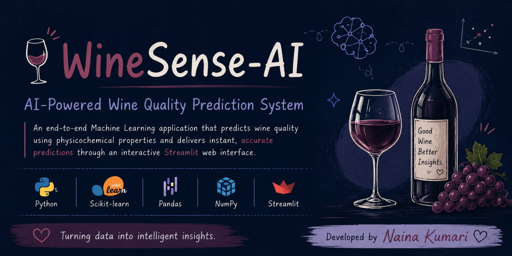
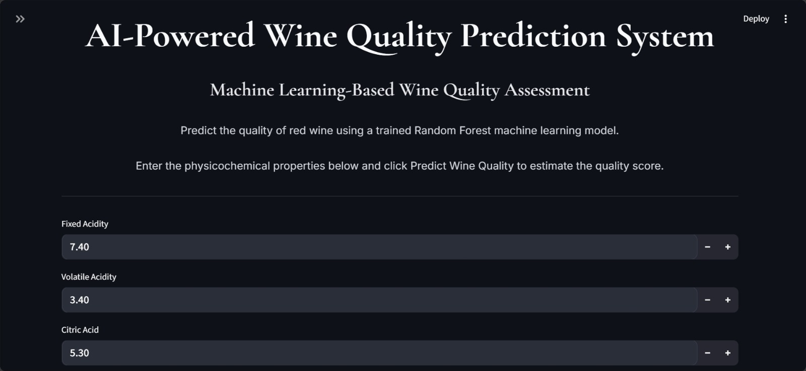
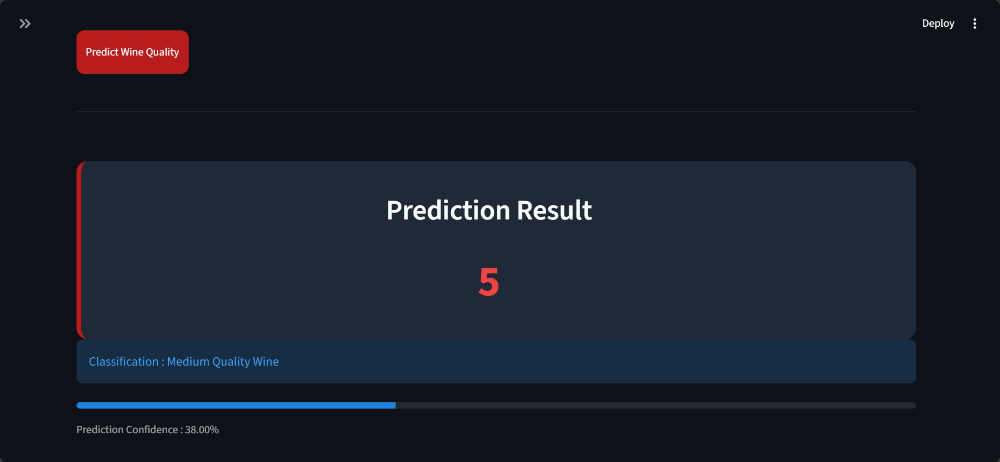

<div align="center">
  
# 🍷 WineSense-AI



---
## AI-Powered Wine Quality Prediction System

*Transforming physicochemical wine characteristics into intelligent quality predictions using Machine Learning.*


**Developed by Naina Kumari**

</div>

---

# Project Vision

WineSense-AI is an end-to-end Machine Learning application designed to predict wine quality using its physicochemical properties. The project demonstrates the complete Data Science lifecycle—from data preprocessing and exploratory analysis to model training, evaluation, and deployment through an interactive Streamlit web application.

The objective of this project is to showcase how Machine Learning can transform structured data into practical, intelligent solutions while delivering a clean and user-friendly experience.

---

# Why This Project?

Wine quality assessment traditionally relies on expert evaluation, which can be subjective and time-consuming. WineSense-AI provides an AI-assisted approach that predicts wine quality instantly using scientific measurements, making the evaluation process faster, more consistent, and data-driven.

---

# Core Features

- AI-powered wine quality prediction
- Interactive Streamlit interface
- Real-time prediction results
- Data preprocessing pipeline
- Feature engineering techniques
- Trained Machine Learning model
- Responsive and beginner-friendly UI
- Fast and lightweight deployment
- Easy reproducibility for future enhancements

---

# Tech Stack

| Category | Technology |
|------------|----------------|
| Programming Language | Python |
| Machine Learning | Scikit-learn |
| Data Analysis | Pandas, NumPy |
| Visualization | Matplotlib |
| Web Framework | Streamlit |
| Model Storage | Joblib |
| Version Control | Git & GitHub |

---

# Project Architecture

```text
WineSense-AI/
│
├── app/
├── data/
├── models/
├── notebook/
├── images/
│   ├── home.png
│   └── prediction.png
├── banner.png
├── requirements.txt
└── README.md
```

---

<h2>🏠 Home Screen</h2>


<h2>📊 Prediction Screen</h2>

# Live Demohttps://winesense-ai-oyr5ynivmpefuorhdcxpb4.streamlit.app

---

# GitHub Repository

https://github.com/Naina137/WineSense-AI

---

# Installation

Clone the repository

```bash
git clone https://github.com/Naina137/WineSense-AI.git
```

Move into the project

```bash
cd WineSense-AI
```

Install dependencies

```bash
pip install -r requirements.txt
```

Launch the application

```bash
streamlit run app/app.py
```

---

# Machine Learning Pipeline

- Data Collection
- Data Cleaning
- Exploratory Data Analysis
- Feature Engineering
- Data Splitting
- Model Training
- Model Evaluation
- Model Serialization
- Streamlit Deployment

---

# Future Enhancements

- Deep Learning model integration
- Multiple ML model comparison
- Explainable AI (XAI)
- Batch prediction using CSV upload
- Interactive analytics dashboard
- Cloud deployment
- User authentication
- Prediction history

---

# Skills Demonstrated

- Machine Learning
- Data Analysis
- Feature Engineering
- Data Visualization
- Model Deployment
- Python Programming
- Streamlit Development
- Git & GitHub
- Project Documentation

---

# Learning Outcomes

This project helped strengthen my understanding of:

- Building complete Machine Learning applications
- Working with structured datasets
- Feature engineering techniques
- Model optimization and evaluation
- Deploying ML models using Streamlit
- Writing clean, maintainable Python code
- Managing projects using Git and GitHub

---

# About the Developer

## Naina Kumari

**B.Tech | Computer Science & Engineering (Data Science)**

I am an aspiring Data Scientist with a strong interest in Machine Learning, Artificial Intelligence, Data Analytics, and Full-Stack Development. I enjoy building intelligent applications that solve real-world problems through data-driven approaches while continuously expanding my technical expertise.

I believe in continuous learning, practical implementation, and creating impactful projects that bridge technology and real-world challenges.

---

# Connect With Me

**GitHub**

https://github.com/Naina137

**LinkedIn**

https://www.linkedin.com/in/naina-kumari-06373132b

**Live Application**

https://winesense-ai-oyr5ynivmpefuorhdcxpb4.streamlit.app

---

# Acknowledgements

Special thanks to the open-source community and the developers behind Python, Scikit-learn, Pandas, NumPy, Matplotlib, Streamlit, and GitHub for providing the tools that made this project possible.

---

# License

This project is released for educational, academic, and portfolio purposes.

---

<div align="center">

# ⭐ If you found this project useful, please consider giving it a Star.

*"Turning data into intelligent insights through Machine Learning."*

**Thank you for visiting my repository. Happy Coding! 🚀**

</div>
